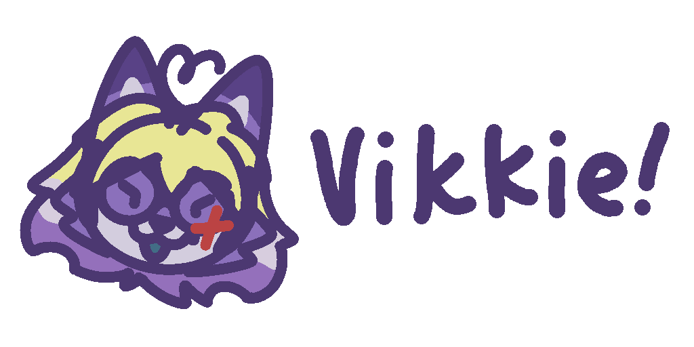
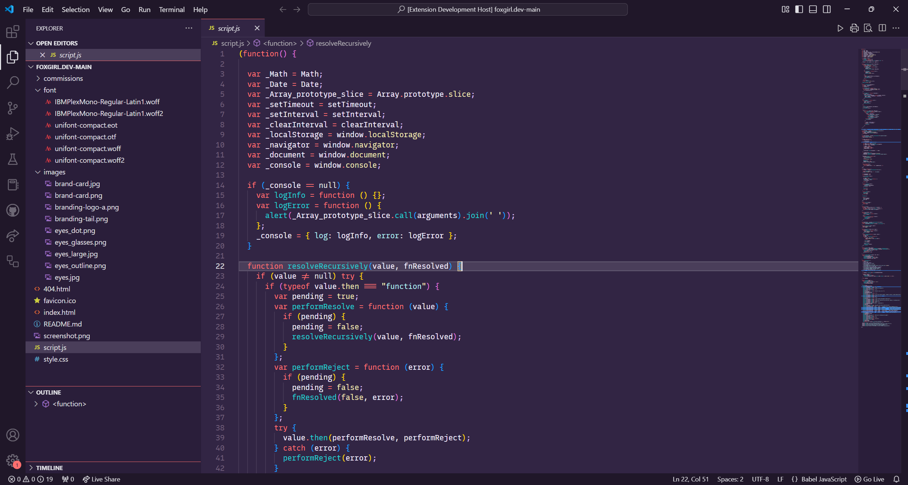
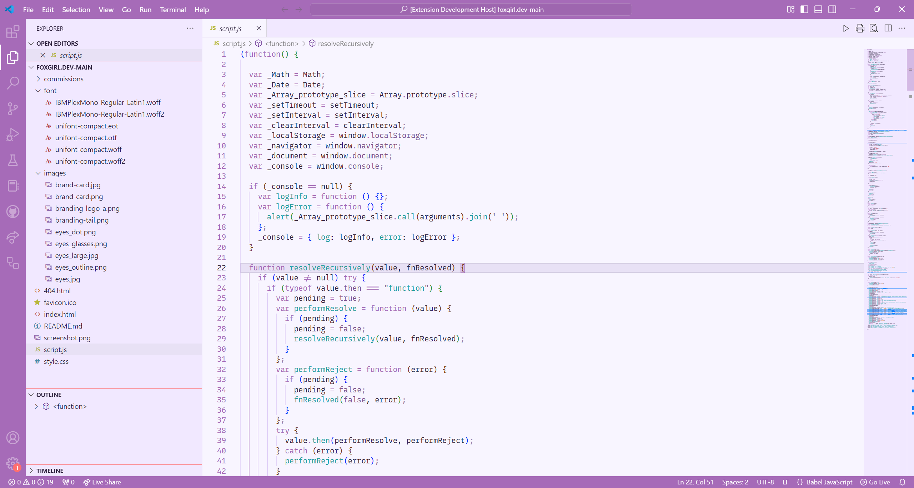

# Vikkie!!! Theme

A VSCode theme based on [luavixen](https://foxgirl.dev/)'s fursona [Vikkie](https://foxgirl.dev/vikkie/)!!!

Made for luavixen's Birthday.

## Screenshots

## Color Summary

### Dark

**Background Colors**

- Dark Purple (Main Background): `#322544`
- Darker Purple (Sidebar): `#2A1E3A`
- Darkest Purple (Activity Bar): `#201729`

**Text Colors**

- Light Gray (Main Text): `#E1E1E6`
- Muted Gray (Inactive Text): `#6A6D77`

**Accent Colors**

- Bright Red: `#FF6F6F`
- Light Yellow: `#f1e8b2`
- Soft Purple: `#A66BB8`
- Cyan: `#22ced0`
- Light Blue: `#66a5e2`

**UI Element Colors**

- Highlight Purple: `#4A3E5A`
- Selection Purple: `#A66BB8AA` (with alpha)
- Border Color: `#4A3E5A`

**Syntax Highlighting Colors**

- String: `#AEECEF`
- Numeric: `#FF8B91`
- Comment: `#D1B8F3`
- Keyword: `#FF6F6F`
- Function: `#22CED0`
- Variable: `#66A5E2`
- Type: `#f4eeff`

**Terminal Colors**

- ANSI Black: `#100e23`
- ANSI Red: `#ff5458`
- ANSI Green: `#62d196`
- ANSI Yellow: `#ffb378`
- ANSI Blue: `#65b2ff`
- ANSI Magenta: `#906cff`
- ANSI Cyan: `#63f2f1`
- ANSI White: `#a6b3cc`

### Light

**Background Colors**

- Light (Main Background): `#F8F5FF`
- Light Purple (Sidebar): `#F1E8FF`
- Soft Purple (Activity Bar): `#A66BB8`

**Text Colors**

- Dark Purple (Main Text): `#2A1E3A`
- Muted Gray (Inactive Text): `#6A6D77`

**Accent Colors**

- Bright Red: `#FF6F6F`
- Deep Purple: `#805592`
- Soft Purple: `#A66BB8`
- Cyan: `#22A0A1`
- Blue: `#2B76B9`

**UI Element Colors**

- Highlight Purple: `#E8E1F5`
- Selection Purple: `#A66BB855` (with alpha)
- Border Color: `#E8E1F5`

**Syntax Highlighting Colors**

- String: `#22A0A1`
- Numeric: `#D14045`
- Comment: `#9B7FA8`
- Keyword: `#A66BB8`
- Function: `#22A0A1`
- Variable: `#2B76B9`
- Type: `#322544`

**Terminal Colors**

- ANSI Black: `#2A1E3A`
- ANSI Red: `#FF6F6F`
- ANSI Green: `#059669`
- ANSI Yellow: `#D97706`
- ANSI Blue: `#3B82F6`
- ANSI Magenta: `#A66BB8`
- ANSI Cyan: `#06B6D4`
- ANSI White: `#E8E1F5`

## License

MIT
